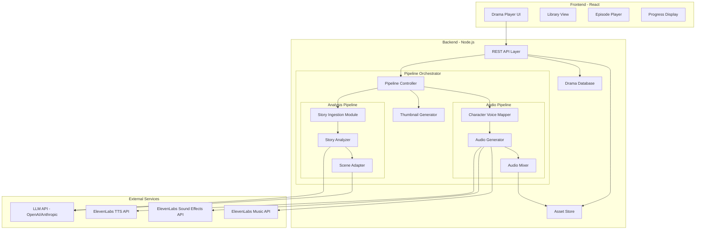
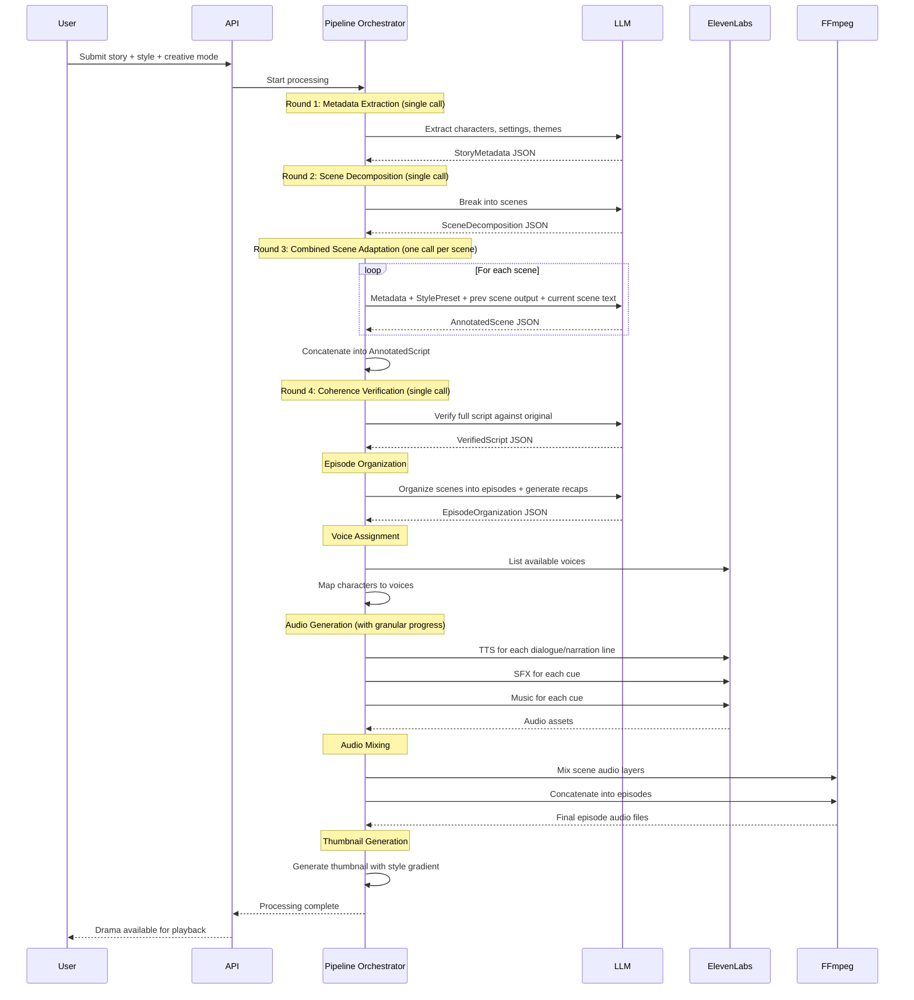

# Design Document: Audio Drama Engine

## Overview

The Audio Drama Engine is a full-stack application that transforms written stories into fully produced, multi-layered audio dramas. The system orchestrates an LLM-powered multi-round analysis pipeline with scene-by-scene adaptation, ElevenLabs API integrations (TTS, Sound Effects, Music), FFmpeg-based audio mixing, and a premium streaming-style player UI.

The architecture follows a staged pipeline pattern where each stage produces a well-defined intermediate output consumed by the next stage. This decoupling enables independent debugging, caching, and retry at each stage. The combined scene adaptation round (Round 3) merges dramatization, SFX annotation, and music annotation into a single LLM call per scene, with context passing from the previous scene.

### Key Design Decisions

1. **TypeScript + Node.js backend**: Chosen for native streaming support, strong ElevenLabs JS SDK support (`@elevenlabs/elevenlabs-js`), and FFmpeg bindings via `fluent-ffmpeg`.
2. **React frontend**: For the premium Drama Player UI with streaming-platform aesthetics.
3. **Staged pipeline with intermediate JSON format**: Each pipeline stage reads/writes a structured JSON document, enabling stage-level retry, caching, and debugging.
4. **Scene-by-scene adaptation with context passing**: Round 3 processes one scene at a time, passing the previous scene's output as context. This improves coherence and reduces per-call token usage compared to processing all scenes at once.
5. **Combined adaptation round**: Dramatization, SFX annotation, and music annotation are merged into a single LLM call per scene (Round 3), producing a complete AnnotatedScene. This ensures SFX and music are coherently designed alongside dialogue rather than bolted on after.
6. **Style presets injected into prompts**: Each DramaStyle has a structured StylePreset configuration that is injected into the combined scene adaptation prompt, ensuring consistent tonal influence.
7. **FFmpeg for mixing**: Industry-standard audio processing, invoked as a subprocess via `fluent-ffmpeg`.
8. **File-based asset storage**: Generated audio assets stored on local filesystem with references in the intermediate format, suitable for single-user or small-scale deployment.
9. **Browser localStorage for playback position**: Playback position is persisted client-side using localStorage, eliminating backend endpoints for this concern.
10. **Programmatic thumbnail generation**: Thumbnails are generated server-side using a Node.js canvas library with style-specific color palettes, avoiding external image services.

## Architecture

### High-Level System Architecture



### Pipeline Flow




## Components and Interfaces

### 1. Story Ingestion Module

Accepts user input (file upload or prompt) and produces raw story text. Supports .txt, .md, .pdf, and .epub formats up to 5MB.

```typescript
interface StoryIngestionModule {
  /** Accept uploaded file, extract and return story text */
  ingestFile(file: Buffer, filename: string): Promise<StoryInput>;
  
  /** Generate a story from a user prompt via LLM */
  generateFromPrompt(prompt: string, options?: StoryGenOptions): Promise<StoryInput>;
}

interface StoryGenOptions {
  style?: DramaStyle;
  lengthPreference?: 'short' | 'medium' | 'long';
}

interface StoryInput {
  id: string;
  text: string;
  source: 'upload' | 'generated';
  title?: string;
}
```

**Constraints**: Max file size 5MB. Supported formats: `.txt`, `.md`, `.pdf` (via `pdf-parse`), `.epub` (via `epub2` or `epubjs`). Empty/whitespace-only files rejected with descriptive error.

### 2. Story Analyzer

Performs Round 1 (metadata extraction), Round 2 (scene decomposition), and Round 4 (coherence verification). Each round is a single LLM call.

```typescript
interface StoryAnalyzer {
  /** Round 1: Extract metadata from story (single LLM call) */
  extractMetadata(story: StoryInput, style: DramaStyle): Promise<StoryMetadata>;
  
  /** Round 2: Decompose into scenes (single LLM call) */
  decomposeScenes(story: StoryInput, metadata: StoryMetadata): Promise<SceneDecomposition>;
  
  /** Round 4: Verify coherence of final script against original (single LLM call) */
  verifyCoherence(
    original: StoryInput,
    metadata: StoryMetadata,
    script: AnnotatedScript,
    creativeMode: boolean
  ): Promise<VerifiedScript>;
  
  /** Infer drama style from story content when none selected */
  inferStyle(story: StoryInput): Promise<DramaStyle>;
  
  /** Organize scenes into episodes with recap narration */
  organizeEpisodes(scenes: Scene[], metadata: StoryMetadata): Promise<EpisodeOrganization>;
}
```

### 3. Scene Adapter

Performs Round 3: combined scene adaptation. Iterates scene by scene, producing one AnnotatedScene per LLM call. Each call receives full metadata, the StylePreset, the previous scene's output, and the current scene's raw text.

```typescript
interface SceneAdapter {
  /** Round 3: Adapt all scenes one by one with context passing */
  adaptAllScenes(
    scenes: SceneDecomposition,
    storyText: string,
    metadata: StoryMetadata,
    style: DramaStyle,
    creativeMode: boolean
  ): Promise<AnnotatedScript>;
  
  /** Adapt a single scene (internal, called iteratively) */
  adaptScene(
    sceneDefinition: SceneDefinition,
    sceneRawText: string,
    metadata: StoryMetadata,
    stylePreset: StylePreset,
    previousSceneOutput: AnnotatedScene | null,
    creativeMode: boolean
  ): Promise<AnnotatedScene>;
}
```

### 4. Style Preset Configuration

Each DramaStyle has a structured StylePreset that is injected into the combined scene adaptation prompt.

```typescript
interface StylePreset {
  style: DramaStyle;
  narration_style: string;
  dialogue_style: string;
  music_preferences: string;
  ambient_preferences: string;
  sfx_style: string;
  pacing: string;
  voice_aesthetic: string;
}

const STYLE_PRESETS: Record<DramaStyle, StylePreset> = {
  anime: {
    style: 'anime',
    narration_style: 'Dramatic, emotionally heightened narration with inner monologue flavor',
    dialogue_style: 'Expressive, emotionally heightened dialogue with dramatic reactions, inner monologue expressed aloud, anime-style exclamations and dramatic pauses',
    music_preferences: 'J-pop influenced orchestral, dramatic stingers, emotional piano pieces, battle themes with driving percussion',
    ambient_preferences: 'School bells, cherry blossom wind, bustling city sounds, dramatic wind gusts',
    sfx_style: 'Dramatic impact sounds, whooshes, sparkle effects, exaggerated environmental sounds, comedic sound effects, dramatic stingers',
    pacing: 'Dynamic with dramatic pauses, building tension followed by explosive emotional releases',
    voice_aesthetic: 'Exaggerated, expressive, wide emotional range'
  },
  noir: {
    style: 'noir',
    narration_style: 'World-weary, sardonic first-person narration with hard-boiled wit',
    dialogue_style: 'Terse, cynical dialogue with clipped sentences, metaphor, and emotional distance',
    music_preferences: 'Jazz, smoky saxophone, muted trumpet, slow blues piano, noir orchestral',
    ambient_preferences: 'Rain on pavement, city traffic, jazz club backgrounds, distant sirens',
    sfx_style: 'Rain, footsteps on wet pavement, cigarette lighter clicks, muted gunshots, glass clinking',
    pacing: 'Slow, deliberate, with lingering silences and measured reveals',
    voice_aesthetic: 'Gritty, measured, low-register'
  },
  'dark-thriller': {
    style: 'dark-thriller',
    narration_style: 'Tense, urgent narration that builds psychological suspense',
    dialogue_style: 'Measured dialogue with subtext, reluctant information reveals, psychological tension',
    music_preferences: 'Tense orchestral, pulsing bass, dissonant strings, minimal piano, suspense drones',
    ambient_preferences: 'Clock ticking, heartbeats, distant thunder, creaking structures',
    sfx_style: 'Tense ambient drones, heartbeats, clock ticking, sudden silence breaks, door creaks, sharp metallic sounds',
    pacing: 'Tight, urgent, with sudden shifts and mounting pressure',
    voice_aesthetic: 'Tense, controlled, with restrained intensity'
  },
  horror: {
    style: 'horror',
    narration_style: 'Unsettling narration that builds dread through understatement and implication',
    dialogue_style: 'Vulnerable dialogue expressing denial, creeping realization, hesitations, whispered lines, terrified silence',
    music_preferences: 'Dissonant strings, music box melodies, deep drones, sudden stingers, eerie choral',
    ambient_preferences: 'Dripping water, distant whispers, wind through empty corridors, creaking wood',
    sfx_style: 'Unsettling creaks, distant whispers, sudden impacts, eerie wind, dripping water, scratching sounds, unnatural silence',
    pacing: 'Slow build with sudden shocks, long silences punctuated by jarring sounds',
    voice_aesthetic: 'Unsettling, varied between whisper and scream'
  },
  cyberpunk: {
    style: 'cyberpunk',
    narration_style: 'Edgy, street-smart narration mixing high-tech concepts with low-life grit',
    dialogue_style: 'Edgy dialogue with tech jargon, slang, cynicism about authority, casual tech references',
    music_preferences: 'Synthwave, pulsing bass, electronic beats, glitchy textures, industrial, neon-soaked synths',
    ambient_preferences: 'Electronic hums, neon buzzing, dense urban soundscapes, distant sirens, rain on metal',
    sfx_style: 'Electronic hums, neon buzzing, hydraulic hisses, digital glitches, hologram activation sounds',
    pacing: 'Fast-paced with information density, quick cuts between scenes',
    voice_aesthetic: 'Edgy, stylized, with digital processing hints'
  },
  'fantasy-epic': {
    style: 'fantasy-epic',
    narration_style: 'Grand, sweeping narration with a sense of ancient lore and destiny',
    dialogue_style: 'Rich, formal dialogue with heroic declarations, wise counsel, and emotional depth',
    music_preferences: 'Full orchestral scoring, heroic brass fanfares, ethereal choral, Celtic strings, epic percussion',
    ambient_preferences: 'Forest birdsong, rushing rivers, castle echoes, campfire crackling, wind across plains',
    sfx_style: 'Sword clashes, horse hooves, magical energy, dragon roars, nature sounds, armor clanking',
    pacing: 'Epic pacing with grand reveals, building to climactic moments',
    voice_aesthetic: 'Rich, resonant, with gravitas and warmth'
  },
  romance: {
    style: 'romance',
    narration_style: 'Warm, intimate narration with emotional vulnerability and tenderness',
    dialogue_style: 'Intimate, emotionally honest dialogue with gentle humor, longing, and warmth',
    music_preferences: 'Soft piano, acoustic guitar, gentle strings, warm jazz, indie folk',
    ambient_preferences: 'Café sounds, gentle rain, ocean waves, birdsong, rustling leaves',
    sfx_style: 'Gentle environmental sounds, soft footsteps, door opening, coffee pouring, heartbeat',
    pacing: 'Gentle, unhurried, with lingering emotional moments',
    voice_aesthetic: 'Warm, soft, intimate tones'
  },
  comedy: {
    style: 'comedy',
    narration_style: 'Witty, self-aware narration with comedic timing and playful asides',
    dialogue_style: 'Snappy, quick-witted dialogue with comedic timing, exaggerated reactions, and punchlines',
    music_preferences: 'Upbeat jazz, quirky woodwinds, playful pizzicato, comedic stingers, bouncy themes',
    ambient_preferences: 'Lively crowd sounds, upbeat city ambience, party backgrounds',
    sfx_style: 'Exaggerated SFX, cartoon-style impacts, comedic timing sounds, record scratches, slide whistles',
    pacing: 'Quick, snappy, with well-timed pauses for comedic effect',
    voice_aesthetic: 'Expressive, varied, with comedic range'
  },
  documentary: {
    style: 'documentary',
    narration_style: 'Authoritative, measured narration with journalistic clarity and gravitas',
    dialogue_style: 'Natural, realistic dialogue with authentic speech patterns and measured delivery',
    music_preferences: 'Minimal scoring, subtle ambient pads, sparse piano, restrained strings',
    ambient_preferences: 'Realistic environmental sounds, room tone, outdoor ambience, traffic',
    sfx_style: 'Realistic, understated sound effects that ground the listener in the setting',
    pacing: 'Measured, deliberate, with space for reflection',
    voice_aesthetic: 'Authoritative, clear, natural delivery'
  },
  cinematic: {
    style: 'cinematic',
    narration_style: 'Balanced, versatile narration that adapts to the emotional needs of each scene',
    dialogue_style: 'Natural yet polished dialogue with clear emotional beats and professional delivery',
    music_preferences: 'Versatile orchestral and electronic scoring, adapting mood to scene needs',
    ambient_preferences: 'Rich environmental soundscapes appropriate to each setting',
    sfx_style: 'Professional, balanced sound design with both subtle and dramatic effects as needed',
    pacing: 'Balanced pacing that serves the story, neither rushed nor lingering',
    voice_aesthetic: 'Professional, balanced, neutral default'
  }
};
```

### 5. Character Voice Mapper

Assigns ElevenLabs voice profiles to characters.

```typescript
interface CharacterVoiceMapper {
  /** Assign voice profiles to all characters + narrator */
  assignVoices(
    characters: CharacterMetadata[],
    style: DramaStyle
  ): Promise<VoiceAssignment[]>;
}

interface VoiceAssignment {
  characterId: string;
  characterName: string;
  voiceId: string;          // ElevenLabs voice ID
  voiceSettings: VoiceSettings;
  role: 'character' | 'narrator';
}

interface VoiceSettings {
  stability: number;        // 0.0-1.0
  similarityBoost: number;  // 0.0-1.0
  style: number;            // 0.0-1.0
  speed: number;            // 0.7-1.2
  useSpeakerBoost: boolean;
}
```

**Style-aware voice settings presets**:
- Anime: `{ stability: 0.3, similarityBoost: 0.8, style: 0.5 }` — exaggerated, expressive
- Noir: `{ stability: 0.6, similarityBoost: 0.7, style: 0.3 }` — gritty, measured
- Horror: `{ stability: 0.4, similarityBoost: 0.8, style: 0.4 }` — unsettling, varied
- Cyberpunk: `{ stability: 0.5, similarityBoost: 0.7, style: 0.4 }` — edgy, stylized
- Dark Thriller: `{ stability: 0.5, similarityBoost: 0.75, style: 0.3 }` — tense, controlled
- Fantasy Epic: `{ stability: 0.5, similarityBoost: 0.8, style: 0.4 }` — rich, resonant
- Romance: `{ stability: 0.6, similarityBoost: 0.8, style: 0.3 }` — warm, soft
- Comedy: `{ stability: 0.3, similarityBoost: 0.7, style: 0.5 }` — expressive, varied
- Documentary: `{ stability: 0.7, similarityBoost: 0.8, style: 0.2 }` — authoritative, clear
- Cinematic: `{ stability: 0.5, similarityBoost: 0.75, style: 0.35 }` — balanced, professional


### 6. Audio Generator

Calls ElevenLabs APIs to produce audio assets.

```typescript
interface AudioGenerator {
  /** Generate TTS audio for a dialogue line */
  generateSpeech(line: DialogueLine, voice: VoiceAssignment): Promise<AudioAsset>;
  
  /** Generate TTS audio for a narration line */
  generateNarration(line: NarrationLine, voice: VoiceAssignment): Promise<AudioAsset>;
  
  /** Generate a sound effect from a cue */
  generateSFX(cue: SFXCue): Promise<AudioAsset>;
  
  /** Generate a music track from a cue */
  generateMusic(cue: MusicCue): Promise<AudioAsset>;
  
  /** Process all audio generation for the full intermediate format, emitting granular progress */
  generateAll(
    format: IntermediateFormat,
    voices: VoiceAssignment[],
    onProgress: (detail: string) => void
  ): Promise<AudioManifest>;
}
```

**ElevenLabs API Integration Details**:

- **TTS**: Uses `client.textToSpeech.convert()` with `eleven_flash_v2_5` model for speed. Each dialogue line is a separate API call with the assigned voice ID and per-character voice settings. Expression tags in the script text guide emotional delivery.
- **Sound Effects**: Uses `POST /v1/sound-generation` with prompt text derived from the SFX cue description. `duration_seconds` set from cue duration. `loop: true` for ambient SFX. `prompt_influence: 0.7` default.
- **Music**: Uses `client.music.compose()` with prompt derived from music cue mood/style. `music_length_ms` from cue duration. `force_instrumental: true` for underscore cues.

**Retry policy**: 3 retries with exponential backoff (1s, 2s, 4s) on API failures.

**Caching**: SHA-256 hash of (API endpoint + request params) used as cache key. Cached assets stored on filesystem. Cache checked before every API call within a session.

**Granular progress**: The `generateAll` method calls `onProgress` with descriptive messages like "Generating voice 3 of 12", "Generating sound effect 5 of 8", "Generating music track 2 of 4". The Pipeline Orchestrator forwards these to the frontend via status updates.

### 7. Audio Mixer

Combines audio layers using FFmpeg.

```typescript
interface AudioMixer {
  /** Mix all audio layers for a single scene */
  mixScene(scene: SceneMixInput): Promise<string>; // returns path to mixed file
  
  /** Concatenate scene audio files into an episode */
  concatenateEpisode(scenePaths: string[], episodeId: string): Promise<string>;
}

interface SceneMixInput {
  sceneId: string;
  dialogueTracks: TimedAudioTrack[];
  sfxTracks: TimedAudioTrack[];
  musicTracks: TimedAudioTrack[];
}

interface TimedAudioTrack {
  assetPath: string;
  startTimeMs: number;
  durationMs: number;
  volume: number;           // 0.0-1.0
  transition?: MusicTransition;
  loop?: boolean;
}
```

**FFmpeg mixing strategy**:
- Dialogue base volume: 1.0 (reference level)
- SFX volume: 0.6 default, adjustable per cue
- Music volume: 0.3 for underscore, 0.5 for featured
- Ambient SFX: looped via `-stream_loop -1` with duration trim
- Transitions: `afade` filter for fade-in/out, `acrossfade` for crossfade
- Output format: MP3 44.1kHz 192kbps

### 8. Thumbnail Generator

Generates drama cover thumbnails programmatically.

```typescript
interface ThumbnailGenerator {
  /** Generate a thumbnail for a drama */
  generateThumbnail(title: string, style: DramaStyle): Promise<string>; // returns file path
}
```

**Implementation**: Uses a Node.js canvas library (e.g., `canvas` / `@napi-rs/canvas`) to render a 640x360px PNG image.

**Rendering**:
1. Draw gradient background using style-specific color palette
2. Render drama title text (centered, white with shadow for readability)
3. Render style badge (rounded rectangle with style name)

**Style-specific color palettes** (gradient from → to):
| Style | From | To |
|-------|------|----|
| Noir | Charcoal (#36454F) | Amber (#FFBF00) |
| Anime | Pink (#FF69B4) | Lavender (#E6E6FA) |
| Horror | Black (#000000) | Blood Red (#8B0000) |
| Cyberpunk | Purple (#800080) | Neon Cyan (#00FFFF) |
| Dark Thriller | Navy (#000080) | Steel Gray (#71797E) |
| Fantasy Epic | Dark Green (#013220) | Gold (#FFD700) |
| Romance | Blush Pink (#FF6FFF) | Coral (#FF7F50) |
| Comedy | Bright Yellow (#FFFF00) | Orange (#FFA500) |
| Documentary | Cool Gray (#8C92AC) | White (#FFFFFF) |
| Cinematic | Deep Indigo (#310062) | Silver (#C0C0C0) |

Generated once at drama creation time and stored on the filesystem.

### 9. Pipeline Orchestrator

Coordinates the full pipeline, manages state, reports progress with granular detail.

```typescript
interface PipelineOrchestrator {
  /** Start processing a story through the full pipeline */
  startProcessing(request: ProcessingRequest): Promise<string>; // returns job ID
  
  /** Get current status of a processing job */
  getStatus(jobId: string): Promise<PipelineStatus>;
  
  /** Cancel a processing job */
  cancelJob(jobId: string): Promise<void>;
}

interface ProcessingRequest {
  storyInput: StoryInput;
  style?: DramaStyle;
  creativeMode: boolean;
}

type PipelineStage = 
  | 'ingestion'
  | 'metadata_extraction'
  | 'scene_decomposition'
  | 'scene_adaptation'
  | 'coherence_verification'
  | 'voice_assignment'
  | 'audio_generation'
  | 'audio_mixing'
  | 'thumbnail_generation'
  | 'complete'
  | 'failed';

interface PipelineStatus {
  jobId: string;
  stage: PipelineStage;
  progress: number;         // 0-100
  stageDetail?: string;     // e.g., "Adapting scene 3 of 8", "Generating voice 5 of 12"
  error?: PipelineError;
}
```

**Pipeline stages** (in order):
1. Ingestion → StoryInput
2. Metadata extraction (Round 1) → StoryMetadata
3. Scene decomposition (Round 2) → SceneDecomposition
4. Combined scene adaptation (Round 3) → AnnotatedScript (one LLM call per scene, with context passing)
5. Coherence verification (Round 4) → VerifiedScript
6. Episode organization → EpisodeOrganization (with recap narration for episodes 2+)
7. Voice assignment → VoiceAssignment[]
8. Audio generation → AudioManifest (with granular progress: "Generating voice 3 of 12", etc.)
9. Audio mixing → Episode audio files
10. Thumbnail generation → Thumbnail image

### 10. REST API Layer

```typescript
// Story submission
POST   /api/dramas                    // Submit story for processing
GET    /api/dramas                    // List all dramas
GET    /api/dramas/:id                // Get drama details + episodes
DELETE /api/dramas/:id                // Delete a drama

// Processing
GET    /api/dramas/:id/status         // Get pipeline status (includes stageDetail)

// Playback
GET    /api/dramas/:id/episodes/:epId/audio  // Stream episode audio

// Configuration
GET    /api/styles                    // List available drama styles with presets
```

Note: Playback position persistence is handled client-side via browser localStorage. No backend endpoints needed for position save/load.

### 11. Drama Player UI Components

```
DramaPlayerApp
├── LibraryView
│   ├── DramaCard (thumbnail, title, style badge, episode count)
│   └── CreateDramaModal
│       ├── FileUploadInput (.txt, .md, .pdf, .epub)
│       ├── PromptInput
│       ├── StyleSelector (10 styles)
│       └── CreativeModeToggle
├── DramaDetailView
│   ├── DramaHeader (title, thumbnail, style, synopsis)
│   └── EpisodeList
│       └── EpisodeCard (title, synopsis, duration, play button)
├── PlayerBar (persistent bottom bar)
│   ├── PlayPauseButton
│   ├── SkipBackward15Button
│   ├── SkipForward15Button
│   ├── SeekBar (progress bar with scrubbing)
│   ├── TimeDisplay (elapsed / total)
│   └── NowPlayingInfo (episode title, drama title)
└── ProcessingView
    ├── StageIndicator (current pipeline stage + detail text)
    └── ProgressBar (estimated progress)
```

**Playback position persistence**: Uses `localStorage.setItem(`drama_${dramaId}_episode_${episodeId}`, positionMs)` on pause/periodic save, and `localStorage.getItem(...)` on episode load to resume.


## Prompt Strategy

### Analysis Prompt (Round 1: Metadata Extraction)

```
SYSTEM: You are an expert story analyst. Extract structured metadata from the provided story.

## Task
Analyze the following story and extract:
- Title
- Genre
- Themes (list)
- Time period
- Narrative arc (exposition, rising action, climax, falling action, resolution)
- Characters (id, name, aliases, age, gender, physical description, personality traits, relationships, role)
- Settings (id, name, description, time period, mood)

## Style Context
The target drama style is: {style}
Apply this style's tonal lens when interpreting mood, character traits, and thematic emphasis.

## Story
{full_story_text}

## Output Format
Output ONLY valid JSON matching the StoryMetadata schema:
{StoryMetadata_JSON_schema}
```

### Scene Decomposition Prompt (Round 2)

```
SYSTEM: You are an expert story structure analyst. Break the provided story into discrete scenes.

## Task
Decompose the story into scenes. Each scene should represent a distinct unit of action in a single location with a consistent set of characters.

## Scene Boundary Rules
- A new scene begins when: location changes, time jumps significantly, the set of active characters changes substantially, or the mood shifts dramatically.
- Each scene must have: a unique ID, sequence number, title, setting reference, participating character IDs, mood, summary, and original text paragraph range.
- Maintain the original narrative order.

## Story
{full_story_text}

## Extracted Metadata
{StoryMetadata_JSON}

## Output Format
Output ONLY valid JSON matching the SceneDecomposition schema:
{SceneDecomposition_JSON_schema}
```

### Combined Scene Adaptation Prompt (Round 3: Per-Scene)

```
SYSTEM: You are an expert audio drama scriptwriter, sound designer, and music director. Adapt the provided scene into a complete AnnotatedScene with dialogue, narration, action cues, SFX cues, and music cues.

## Story Metadata
{StoryMetadata_JSON}

## Style Preset: {style}
- Narration style: {stylePreset.narration_style}
- Dialogue style: {stylePreset.dialogue_style}
- Music preferences: {stylePreset.music_preferences}
- Ambient preferences: {stylePreset.ambient_preferences}
- SFX style: {stylePreset.sfx_style}
- Pacing: {stylePreset.pacing}
- Voice aesthetic: {stylePreset.voice_aesthetic}

## Previous Scene Output
{previous_scene_annotated_json OR "none" for first scene}

## Current Scene to Adapt
Scene ID: {sceneDefinition.id}
Scene Title: {sceneDefinition.title}
Scene Mood: {sceneDefinition.mood}
Participating Characters: {character_names}

Raw Text:
{current_scene_raw_text}

## Creative Mode: {ENABLED|DISABLED}
{if enabled: Creative mode instructions — more liberal rephrasing, atmospheric SFX, liberal music cues, while preserving meaning}
{if disabled: Standard adaptation rules — faithful to source, no embellishments beyond text}

## Dialogue Rules
- Dialogue is the PRIMARY vehicle for conveying story information.
- Use narration ONLY when information cannot be conveyed through dialogue, SFX, music, or actions.
- Every DialogueLine MUST have a non-empty "expression" field.
- Preserve ALL plot points, character motivations, and thematic elements.

## SFX Rules
- Add SFX for: explicit sound mentions, inferred environmental/action sounds, emotional ambience.
- Classify each as "momentary" (with triggerAfterElementId + triggerOffsetMs) or "ambient" (with durationMs).
- Volume: explicit 0.5-0.8, inferred 0.3-0.6, emotional ambience 0.2-0.4.
{if creative: Add atmospheric mood-driven SFX even when not described in text. Mark as source: "creative".}

## Music Rules
- Place music cues selectively at emotional weight, tension, or turning points.
- Use silence as a deliberate dramatic tool.
- Specify mood, intensity (0-1), duration, transition (in/out), and style hints matching the style preset.
- Mark music overlapping dialogue as underscore with volume ≤ 0.3.
{if creative: Add music cues more liberally to amplify atmosphere.}

## Output Format
Output ONLY valid JSON matching the AnnotatedScene schema:
{AnnotatedScene_JSON_schema}
```

### Coherence Verification Prompt (Round 4)

```
SYSTEM: You are an expert story editor and quality assurance reviewer for audio dramas.

## Task
Review the adapted script against the original story and metadata. Check for:
1. Missing characters — any character from metadata not appearing in the script
2. Missing plot points — any narrative arc element not represented
3. Continuity errors — inconsistencies in character behavior, timeline, or setting
4. Pacing issues — scenes that feel rushed or overly drawn out
{if creative mode: 5. Creative appropriateness — verify all creative additions are contextually appropriate, stylistically consistent, and do not introduce contradictions or information loss}

## Original Story
{full_story_text}

## Story Metadata
{StoryMetadata_JSON}

## Full Adapted Script
{AnnotatedScript_JSON}

## Output Format
Output ONLY valid JSON matching the VerifiedScript schema:
{
  "verified": boolean,
  "issues": [{ "type": "information-loss"|"inconsistency"|"pacing"|"creative-fidelity", "description": string, "severity": "low"|"medium"|"high" }],
  "scenes": [... the corrected AnnotatedScene array if issues were found, or the original if clean ...]
}
```


## Data Models

### Core Types

```typescript
type DramaStyle = 'anime' | 'noir' | 'dark-thriller' | 'horror' | 'cyberpunk'
  | 'fantasy-epic' | 'romance' | 'comedy' | 'documentary' | 'cinematic';

type SFXDurationType = 'momentary' | 'ambient';

type MusicTransition = 'fade-in' | 'fade-out' | 'crossfade' | 'hard-cut';
```

### Story Metadata (Round 1 Output)

```typescript
interface StoryMetadata {
  title: string;
  genre: string;
  themes: string[];
  timePeriod: string;
  narrativeArc: {
    exposition: string;
    risingAction: string;
    climax: string;
    fallingAction: string;
    resolution: string;
  };
  characters: CharacterMetadata[];
  settings: SettingMetadata[];
}

interface CharacterMetadata {
  id: string;
  name: string;
  aliases: string[];
  age?: string;
  gender?: string;
  physicalDescription: string;
  personalityTraits: string[];
  relationships: { characterId: string; relationship: string }[];
  role: 'protagonist' | 'antagonist' | 'supporting' | 'minor';
}

interface SettingMetadata {
  id: string;
  name: string;
  description: string;
  timePeriod?: string;
  mood: string;
}
```

### Scene Decomposition (Round 2 Output)

```typescript
interface SceneDecomposition {
  scenes: SceneDefinition[];
}

interface SceneDefinition {
  id: string;
  sequenceNumber: number;
  title: string;
  settingId: string;
  participatingCharacterIds: string[];
  mood: string;
  summary: string;
  originalTextRange: { startParagraph: number; endParagraph: number };
}
```

### Annotated Script (Round 3 Output — built scene by scene)

```typescript
interface AnnotatedScript {
  scenes: AnnotatedScene[];
}

interface AnnotatedScene {
  sceneId: string;
  elements: ScriptElement[];
  sfxCues: SFXCue[];
  musicCues: MusicCue[];
}

type ScriptElement = DialogueLine | NarrationLine | ActionCue;

interface DialogueLine {
  type: 'dialogue';
  id: string;
  characterId: string;
  text: string;
  expression: string;
  parenthetical?: string;
}

interface NarrationLine {
  type: 'narration';
  id: string;
  text: string;
  tone: string;
}

interface ActionCue {
  type: 'action';
  id: string;
  description: string;
}

interface SFXCue {
  id: string;
  description: string;
  durationType: SFXDurationType;
  durationMs?: number;
  triggerAfterElementId: string;
  triggerOffsetMs: number;
  volume: number;
  source: 'explicit' | 'inferred' | 'emotional-ambience' | 'creative';
}

interface MusicCue {
  id: string;
  mood: string;
  intensity: number;
  durationMs: number;
  prompt: string;
  transition: {
    in: MusicTransition;
    out: MusicTransition;
  };
  isUnderscore: boolean;
  volume: number;
  styleHints: string[];
}
```

### Verified Script (Round 4 Output)

```typescript
interface VerifiedScript extends AnnotatedScript {
  verified: true;
  issues: CoherenceIssue[];
}

interface CoherenceIssue {
  type: 'information-loss' | 'inconsistency' | 'pacing' | 'creative-fidelity';
  description: string;
  severity: 'low' | 'medium' | 'high';
}
```

### Intermediate Format (Full Pipeline Output)

```typescript
interface IntermediateFormat {
  version: string;
  dramaId: string;
  title: string;
  style: DramaStyle;
  creativeMode: boolean;
  metadata: StoryMetadata;
  voiceAssignments: VoiceAssignment[];
  episodes: EpisodeDefinition[];
}

interface EpisodeDefinition {
  id: string;
  episodeNumber: number;
  title: string;
  synopsis: string;
  recapNarration?: string;   // "Previously on..." text for episodes 2+
  scenes: AnnotatedScene[];
}
```

### Episode Organization

```typescript
interface EpisodeOrganization {
  episodes: {
    episodeNumber: number;
    title: string;
    synopsis: string;
    recapNarration?: string;  // Generated for episodes 2+
    sceneIds: string[];
  }[];
}
```

### Audio Assets

```typescript
interface AudioAsset {
  id: string;
  sourceId: string;
  type: 'speech' | 'sfx' | 'music';
  filePath: string;
  durationMs: number;
  format: 'mp3';
  cacheKey: string;
}

interface AudioManifest {
  dramaId: string;
  assets: AudioAsset[];
  generatedAt: string;
}
```

### Drama Database Models

```typescript
interface Drama {
  id: string;
  title: string;
  style: DramaStyle;
  creativeMode: boolean;
  thumbnailPath?: string;
  source: 'upload' | 'generated';
  status: 'processing' | 'complete' | 'failed';
  createdAt: string;
  episodes: Episode[];
}

interface Episode {
  id: string;
  dramaId: string;
  episodeNumber: number;
  title: string;
  synopsis: string;
  durationMs: number;
  audioFilePath: string;
  recapNarration?: string;
  scenes: { sceneId: string; title: string }[];
}
```

Note: `PlaybackPosition` is no longer a backend type. Playback position is persisted client-side via browser localStorage.

### Pipeline State

```typescript
interface PipelineJob {
  id: string;
  dramaId: string;
  stage: PipelineStage;
  progress: number;
  stageDetail?: string;
  intermediateFormat?: IntermediateFormat;
  audioManifest?: AudioManifest;
  error?: PipelineError;
  startedAt: string;
  updatedAt: string;
}

interface PipelineError {
  stage: PipelineStage;
  message: string;
  retryCount: number;
  details?: string;
}
```


## Correctness Properties

*A property is a characteristic or behavior that should hold true across all valid executions of a system — essentially, a formal statement about what the system should do.*

### Property 1: File ingestion round-trip

*For any* valid non-empty story text string, creating a file buffer from that text and ingesting it via the Story Ingestion Module should produce a StoryInput whose `text` field is identical to the original string.

**Validates: Requirements 1.1**

### Property 2: Whitespace and empty file rejection

*For any* string composed entirely of whitespace characters (spaces, tabs, newlines, or zero-length), attempting to ingest it as a story file should be rejected with an error, and no StoryInput should be produced.

**Validates: Requirements 1.3**

### Property 3: Drama style propagation

*For any* valid DramaStyle selection (from the full palette of 10 styles), when a story is processed through the pipeline, the style value passed to the Story Analyzer, Scene Adapter, and Character Voice Mapper must all equal the originally selected style.

**Validates: Requirements 2.2**

### Property 4: Dialogue-dominant script structure

*For any* valid AnnotatedScript produced by the Scene Adapter, the total count of `dialogue` type elements across all scenes should be strictly greater than the total count of `narration` type elements.

**Validates: Requirements 4.1**

### Property 5: Expression tags on all dialogue lines

*For any* valid AnnotatedScript, every ScriptElement of type `dialogue` must have a non-empty `expression` field.

**Validates: Requirements 4.3**

### Property 6: Voice assignment uniqueness and consistency

*For any* set of CharacterMetadata and a narrator, the Character Voice Mapper must produce VoiceAssignments where: (a) all `voiceId` values are unique across characters and narrator, and (b) each characterId maps to exactly one voiceId that remains consistent across all scenes and episodes in the IntermediateFormat.

**Validates: Requirements 5.1, 5.2, 5.3**

### Property 7: SFX cue structural validity

*For any* valid AnnotatedScript, every SFXCue must have a `durationType` of either `'momentary'` or `'ambient'`. Additionally, every ambient SFXCue must have a positive `durationMs`, and every momentary SFXCue must have a non-empty `triggerAfterElementId` referencing a valid script element and a defined `triggerOffsetMs`.

**Validates: Requirements 6.3, 6.4, 6.5**

### Property 8: Music cue transition validity

*For any* valid AnnotatedScript, every MusicCue must have `transition.in` and `transition.out` values that are valid MusicTransition types (`'fade-in'`, `'fade-out'`, `'crossfade'`, or `'hard-cut'`).

**Validates: Requirements 7.4**

### Property 9: Underscore flagging on dialogue overlap

*For any* AnnotatedScene where a MusicCue's time range overlaps with any DialogueLine's time range, that MusicCue must have `isUnderscore` set to `true` and its `volume` must be less than or equal to 0.3.

**Validates: Requirements 7.5**

### Property 10: Retry with exponential backoff

*For any* ElevenLabs API call that fails with a transient error, the Audio Generator should retry up to 3 times with exponential backoff delays (1s, 2s, 4s). After 3 failed retries, it should report the failure without further retries.

**Validates: Requirements 8.4**

### Property 11: Audio asset caching idempotence

*For any* audio generation request (TTS, SFX, or Music), calling the generation function twice with identical parameters should result in exactly one external API call, with the second call returning the cached result.

**Validates: Requirements 8.5**

### Property 12: Dialogue volume priority in audio mix

*For any* SceneMixInput, the volume level assigned to dialogue tracks in the FFmpeg filter graph must be strictly greater than the volume assigned to SFX tracks and music tracks. When music is marked as underscore, its volume must be further reduced below the standard music volume.

**Validates: Requirements 9.2, 9.3**

### Property 13: Music transition filter correctness

*For any* MusicTransition type (`fade-in`, `fade-out`, `crossfade`, `hard-cut`), the Audio Mixer must generate the corresponding FFmpeg audio filter (`afade=t=in`, `afade=t=out`, `acrossfade`, or no fade filter respectively) in the filter graph.

**Validates: Requirements 9.4**

### Property 14: Ambient SFX loop coverage

*For any* ambient SFX track with a specified `durationMs`, the Audio Mixer must generate FFmpeg commands that loop or extend the audio to cover at least the specified duration.

**Validates: Requirements 9.5**

### Property 15: Scene concatenation ordering

*For any* list of mixed scene audio files belonging to an episode, the Audio Mixer must concatenate them in ascending scene sequence number order.

**Validates: Requirements 9.6**

### Property 16: Episode scene partitioning

*For any* episode organization produced by the Story Analyzer, every scene must belong to exactly one episode, no scene may appear in multiple episodes, and scenes within each episode must be contiguous in their original sequence order.

**Validates: Requirements 10.1, 10.4**

### Property 17: Episode metadata completeness

*For any* EpisodeDefinition in the output, the `title` and `synopsis` fields must be non-empty strings.

**Validates: Requirements 10.2**

### Property 18: Playback position localStorage round-trip

*For any* valid playback position (dramaId, episodeId, positionMs where positionMs >= 0), saving the position to localStorage with key `drama_${dramaId}_episode_${episodeId}` and then loading it should return the same positionMs value.

**Validates: Requirements 11.6**

### Property 19: Intermediate format schema completeness

*For any* valid IntermediateFormat, it must contain: at least one episode, each episode must have at least one scene, each scene must have at least one script element, every dialogue line must have a `characterId` matching a voice assignment, an `expression` field, and a `text` field, every SFX cue must have `timing` and `durationType`, and every music cue must have `mood` and `transition` specifications.

**Validates: Requirements 12.1**

### Property 20: Unique identifiers across all cues

*For any* valid IntermediateFormat, collecting all `id` values from dialogue lines, narration lines, action cues, SFX cues, and music cues across all scenes and episodes must produce a set with no duplicates.

**Validates: Requirements 12.2**

### Property 21: Pipeline status rendering correctness

*For any* valid PipelineStatus (including stageDetail), the ProcessingView must render the correct stage label, detail text, and progress percentage. When the status contains a PipelineError, the view must additionally display the failed stage name and error message.

**Validates: Requirements 13.1, 13.2, 13.4**

### Property 22: Style preset completeness

*For any* valid DramaStyle value, a corresponding StylePreset must exist with non-empty values for all fields: narration_style, dialogue_style, music_preferences, ambient_preferences, sfx_style, pacing, and voice_aesthetic.

**Validates: Requirements 2.5**

### Property 23: Scene adaptation context passing

*For any* SceneDecomposition with N scenes (N > 1), the Scene Adapter must make exactly N LLM calls for Round 3, and for each call i (where i > 0), the previous scene's AnnotatedScene output must be included in the prompt context.

**Validates: Requirements 3.3**

### Property 24: Thumbnail generation for all styles

*For any* valid DramaStyle, the Thumbnail Generator must produce a 640x360px image file using the style-specific color palette defined in the design.

**Validates: Requirements 15.1, 15.3**


## Error Handling

### Error Categories

| Category | Source | Strategy |
|----------|--------|----------|
| Input Validation | Story Ingestion | Immediate rejection with descriptive message |
| LLM Failures | Story Analyzer, Scene Adapter | Retry up to 2 times, then fail the pipeline stage |
| ElevenLabs API Failures | Audio Generator | Retry up to 3 times with exponential backoff (1s, 2s, 4s) |
| FFmpeg Failures | Audio Mixer | Fail the mixing stage with FFmpeg stderr output |
| Rate Limiting | ElevenLabs APIs | Respect 429 responses, queue and retry after backoff |
| Timeout | All external calls | 30s timeout for LLM calls, 60s for audio generation, 120s for music generation |
| PDF/EPUB Parsing | Story Ingestion | Fail with EXTRACTION_FAILED if parsing library throws |

### Input Validation Errors

```typescript
class StoryIngestionError extends Error {
  constructor(
    public code: 'EMPTY_FILE' | 'FILE_TOO_LARGE' | 'UNSUPPORTED_FORMAT' | 'EXTRACTION_FAILED',
    message: string
  ) {
    super(message);
  }
}
```

- Empty/whitespace files: `EMPTY_FILE` — "The uploaded file contains no extractable text."
- Oversized files: `FILE_TOO_LARGE` — "File exceeds the maximum size of 5MB."
- Unsupported format: `UNSUPPORTED_FORMAT` — "Only .txt, .md, .pdf, and .epub files are supported."
- PDF/EPUB extraction failure: `EXTRACTION_FAILED` — "Failed to extract text from the uploaded file."

### Pipeline Error Propagation

Each pipeline stage wraps errors in a `PipelineError` with the stage name and a user-friendly message. The Pipeline Orchestrator catches stage errors, updates the job status, and propagates the error to the frontend via the status polling endpoint.

```typescript
class PipelineStageError extends Error {
  constructor(
    public stage: PipelineStage,
    public userMessage: string,
    public technicalDetails: string,
    public retryable: boolean
  ) {
    super(userMessage);
  }
}
```

### ElevenLabs API Error Handling

| HTTP Code | Meaning | Action |
|-----------|---------|--------|
| 401 | Invalid API key | Fail immediately, no retry |
| 422 | Invalid parameters | Fail immediately, log request params |
| 429 | Rate limit exceeded | Backoff and retry after `Retry-After` header |
| 500+ | Server error | Retry with exponential backoff |

### Partial Failure Recovery

- If audio generation fails for a single dialogue line or SFX cue after retries, the pipeline marks that asset as failed and continues generating remaining assets.
- The Audio Mixer skips failed assets and produces the best possible output, logging warnings for missing audio.
- The user is notified of partial failures with details on which elements are missing.

### FFmpeg Error Handling

- FFmpeg is invoked as a subprocess. Non-zero exit codes trigger a `PipelineStageError` with the stderr output.
- Common failures (missing codec, invalid input format) are detected by parsing stderr and translated to user-friendly messages.


## Testing Strategy

### Property-Based Testing

Property-based testing (PBT) is used to verify universal correctness properties across randomly generated inputs. The project uses `fast-check` as the PBT library for TypeScript.

**Configuration:**
- Minimum 100 iterations per property test
- Each property test is tagged with a comment referencing its design property
- Tag format: `Feature: audio-drama-engine, Property {number}: {property_text}`

**Properties suitable for PBT** (24 properties from the Correctness Properties section):

| Property | Component Under Test | Generator Strategy |
|----------|---------------------|-------------------|
| 1: File ingestion round-trip | StoryIngestionModule | Random non-empty strings |
| 2: Whitespace rejection | StoryIngestionModule | Random whitespace-only strings |
| 3: Style propagation | PipelineOrchestrator | Random DramaStyle enum values (10 styles) |
| 4: Dialogue-dominant scripts | AnnotatedScript validation | Random valid AnnotatedScript objects |
| 5: Expression tags | AnnotatedScript validation | Random DialogueLine objects |
| 6: Voice uniqueness/consistency | CharacterVoiceMapper | Random CharacterMetadata arrays |
| 7: SFX cue validity | AnnotatedScript validation | Random SFXCue objects |
| 8: Music transition validity | AnnotatedScript validation | Random MusicCue objects |
| 9: Underscore on overlap | AnnotatedScene validation | Random scenes with overlapping timelines |
| 10: Retry backoff | AudioGenerator retry logic | Random failure counts (0-5) |
| 11: Caching idempotence | AudioGenerator cache | Random generation request params |
| 12: Dialogue volume priority | AudioMixer filter graph | Random SceneMixInput objects |
| 13: Transition filters | AudioMixer filter graph | Random MusicTransition values |
| 14: Ambient SFX looping | AudioMixer filter graph | Random ambient SFX with durations |
| 15: Scene concatenation order | AudioMixer concatenation | Random scene lists with sequence numbers |
| 16: Episode partitioning | StoryAnalyzer episode org | Random scene lists |
| 17: Episode metadata | EpisodeDefinition validation | Random EpisodeDefinition objects |
| 18: Playback position round-trip | localStorage persistence | Random position values |
| 19: Intermediate format schema | IntermediateFormat validation | Random IntermediateFormat objects |
| 20: Unique IDs | IntermediateFormat validation | Random IntermediateFormat objects |
| 21: Pipeline status rendering | ProcessingView component | Random PipelineStatus objects |
| 22: Style preset completeness | StylePreset config | All 10 DramaStyle values |
| 23: Scene adaptation context passing | SceneAdapter | Random SceneDecomposition with multiple scenes |
| 24: Thumbnail generation | ThumbnailGenerator | All 10 DramaStyle values |

### Unit Testing (Example-Based)

Unit tests cover specific examples, edge cases, and integration points not suitable for PBT:

- **Story Ingestion**: File at exact size limit boundary, various text encodings, PDF extraction, EPUB extraction
- **Style Inference**: Verify default style inference returns valid DramaStyle from full 10-style palette when none selected (Req 2.3)
- **Style-specific voice settings**: Each DramaStyle produces distinct VoiceSettings presets (Req 5.4)
- **Episode organization**: Short story produces single episode (Req 10.3)
- **Recap narration**: Episodes 2+ have recap text, episode 1 does not (Req 10.5)
- **UI components**: Library view renders all required elements (Req 11.1-11.5)
- **Creative Mode toggle**: Toggle renders and changes state (Req 14.1)
- **Auto-advance**: Episode end triggers next episode playback (Req 11.4)
- **Completion notification**: Pipeline completion triggers UI notification (Req 13.3)
- **Creative mode prompts**: Creative mode on/off changes LLM prompt content (Req 14.8, 14.9)
- **Thumbnail rendering**: Verify thumbnail dimensions and style-specific gradients (Req 15.1-15.3)
- **localStorage playback**: Verify save/load cycle with correct key format (Req 11.6)

### Integration Testing

Integration tests verify external service interactions with mocked dependencies:

- **LLM pipeline rounds**: Mock LLM, verify rounds 1-4 are called in sequence with correct inputs (Req 3.1-3.5)
- **Scene-by-scene context passing**: Mock LLM, verify each scene adaptation call includes previous scene output (Req 3.3)
- **ElevenLabs TTS**: Mock API, verify correct voice ID and text are sent per dialogue line (Req 8.1)
- **ElevenLabs SFX**: Mock API, verify SFX prompts match cue descriptions (Req 8.2)
- **ElevenLabs Music**: Mock API, verify music prompts match cue mood/style (Req 8.3)
- **FFmpeg mixing**: Mock FFmpeg subprocess, verify correct filter graph construction (Req 9.1)
- **Style preset injection**: Verify LLM prompts contain style-specific preset fields (Req 2.4)
- **Creative mode influence**: Verify creative mode changes combined adaptation prompts (Req 14.2-14.7)
- **Coherence verification**: Verify Round 4 includes creative fidelity check when creative mode is on (Req 14.8)
- **Granular progress**: Verify Audio Generator emits progress callbacks during generation (Req 13.4)

### End-to-End Testing

- Full pipeline run with a short test story, verifying output audio files are produced
- Playback flow: create drama → wait for processing → play episode → verify audio streams
